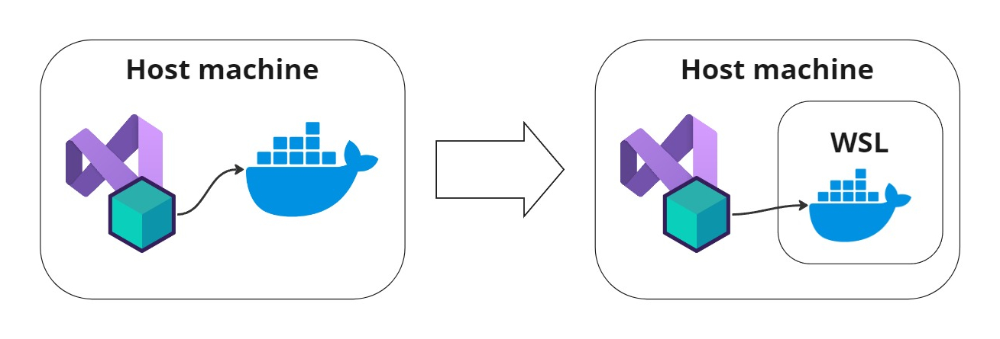

# How to run integration tests using Testcontainers with WSL

The purpose of this demo is to demonstrate how to run integration tests using Testcontainers with WSL. I won't explain how you should write your tests using Testcontainers, my goal is just to show how to run them in WSL.



## Issue

Some people, when developing on Windows, use Docker Desktop, and in that case, the Docker daemon is running on the same machine as the IDE, and the tests are executed without any problem. However, when you are using WSL, the Docker daemon is running on a different machine, and in this case, Testcontainers cannot start the containers because it can't connect to the Docker daemon.


## Solution

### 1. Expose the endpoint of the Docker daemon

In WSL, create a file named `daemon.json` in the folder `/etc/docker/` with the following content:

```json
{
    "hosts": [
        "tcp://0.0.0.0:2375",
        "unix:///var/run/docker.sock"
    ]
}
```

After that, restart the Docker daemon or WSL.

The previous step was obtained from [here](https://gist.github.com/sz763/3b0a5909a03bf2c9c5a057d032bd98b7).


### 2. Configure testcontainers in test project

In your integration tests project, you should have an extension of the `WebApplicationFactory` with configurations for `Testcontainers` similar to this:

```csharp
private readonly IContainer _dbContainer = new ContainerBuilder()
    .WithImage(DB_IMAGE)
    .WithName($"db-integration-tests-{Guid.NewGuid().ToString()[^5..]}")
    .WithEnvironment("MYSQL_ROOT_PASSWORD", DB_ROOT_PASSWORD)
    .WithEnvironment("MYSQL_DATABASE", DB_DATABASE)
    .WithPortBinding(DB_HOST_PORT, DB_CONTAINER_PORT)
    .WithWaitStrategy(Wait.ForUnixContainer().UntilPortIsAvailable(DB_CONTAINER_PORT))
    .Build();
```

You just need to add the configuration of the Docker endpoint `WithDockerEndpoint()`, like this:
```csharp
private readonly IContainer _dbContainer = new ContainerBuilder()
    .WithImage(DB_IMAGE)
    .WithName($"db-integration-tests-{Guid.NewGuid().ToString()[^5..]}")
#if RUN_LOCAL
    .WithDockerEndpoint("tcp://localhost:2375")
#endif
    .WithEnvironment("MYSQL_ROOT_PASSWORD", DB_ROOT_PASSWORD)
    .WithEnvironment("MYSQL_DATABASE", DB_DATABASE)
    .WithPortBinding(DB_HOST_PORT, DB_CONTAINER_PORT)
    .WithWaitStrategy(Wait.ForUnixContainer().UntilPortIsAvailable(DB_CONTAINER_PORT))
    .Build();
```

The `RUN_LOCAL` is a compilation symbol that I use to run the tests locally. In the CI pipeline, I don't use it, so the tests are executed without the `WithDockerEndpoint()` configuration.

If you also want to run the conditional compilation symbol, you need to configure your symbol in the `.csproj` file of the integration tests project, like this:

```xml
<PropertyGroup Condition="'$(COMPUTERNAME)' != ''">
  <DefineConstants>$(DefineConstants);RUN_LOCAL</DefineConstants>
</PropertyGroup>
```

In that configuration, we use the `COMPUTERNAME` environment variable to check if the tests are running locally or not, because in the CI pipeline, this variable is not defined. With this approach, we can set the `RUN_LOCAL` compilation symbol only when the tests are running locally.

The remaining configurations of the `Testcontainers` are normal configurations that you also use when running directly on the host machine.


[Medium Post](https://medium.com/@NelsonBN/how-to-run-integration-tests-using-testcontainers-with-wsl-52c77a2acbbb)